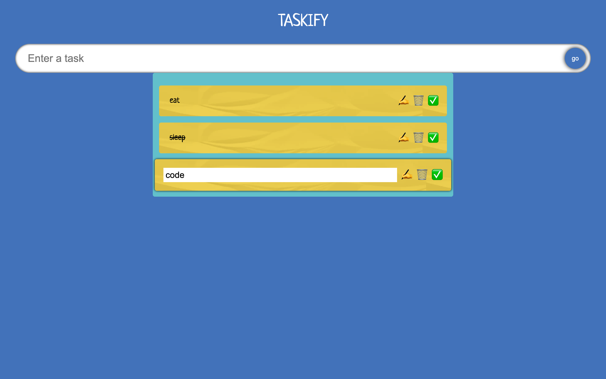

This is a todo app built with react and type script, what makes this project special is that it is my first project utilizing typeScript. You are able to enter a task, edit the task, cross off the task, and when you have completed the task you can remove it from the list.  

<h1> To run on your env: </h1> 
<ul>
    <li> Clone Repo </li>
    <li> run npm i </li>
    <li> project should be running on localhost 3000 </li>
</ul>
